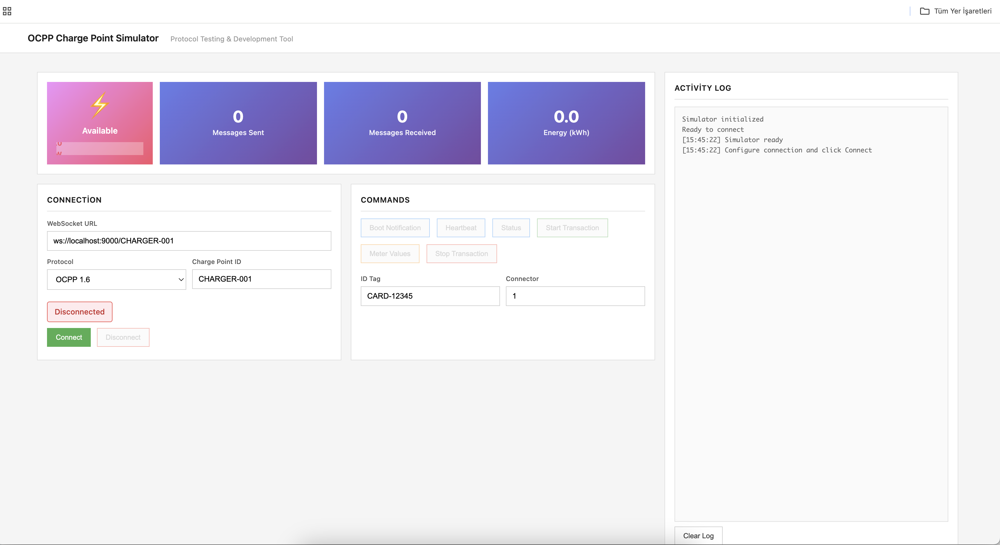

# ChargeSentinel

# 🔋 OCPP Charge Point Simulator

**Elektrikli Araç Şarj İstasyonları için OCPP Protokol Test Platformu**



---

## Hızlı Başlangıç

### 1. Backend Başlat

```bash
cd ocpp-csms
source venv/bin/activate
python3 central_system.py --host 0.0.0.0 --port 9000
```

### 2. Simulator Aç

Tarayıcıda `modern_ev_simulator.html` dosyasını açın.

### 3. Bağlan

- WebSocket URL: `ws://localhost:9000/CHARGER-001`
- "Connect" butonuna tıklayın

---

## Sistem Akışı

### 📊 Komponent Tablosu

| Komponent | Rol | Teknoloji | Durum |
|-----------|-----|-----------|-------|
| **CSMS** | Central System (Backend) | Python + websockets | Port 9000 |
| **Simulator** | Charge Point Emülatörü | HTML + JavaScript | Browser |
| **OCPP Library** | Protokol implementasyonu | Python ocpp==2.0.0 | Active |
| **WebSocket** | İletişim protokolü | ws://localhost:9000 | Bridge |

### 🔄 Mesaj Akış Diyagramı

```
┌──────────────┐         ┌─────────────────┐         ┌─────────────┐
│   Simulator  │  JSON   │  CSMS Backend   │  OCPP   │  ocpp       │
│  (Browser)   │ ◄─────► │   WebSocket     │ ◄─────► │  Library    │
│              │  Port   │   Server        │  Parse  │             │
│  modern_ev_  │   9000  │   Port 9000     │         │  v16/v201   │
│  simulator   │         │                 │         │             │
└──────────────┘         └─────────────────┘         └─────────────┘
     │                           │                         │
     │                           │                         │
     │  1. Send OCPP Message    │                         │
     ├──────────────────────────>│                         │
     │                           │                         │
     │                           │ 2. Receive & Parse       │
     │                           ├────────────────────────>│
     │                           │                         │
     │                           │ 3. Process & Response   │
     │                           │<────────────────────────┤
     │                           │                         │
     │ 4. Receive Response       │                         │
     │<──────────────────────────┤                         │
     │                           │                         │
```

### 🎯 OCPP Mekaniği

| Aşama | Charge Point | CSMS | UI Güncelleme |
|-------|--------------|------|---------------|
| **1. Bağlantı** | ws.connect() | Accept | Status: Connecting |
| **2. Boot** | BootNotification | Respond "Accepted" | statSent++, statReceived++ |
| **3. Heartbeat** | Heartbeat (30sn) | Current time | Log updated |
| **4. Transaction** | StartTransaction | transactionId | Power: 0→7.4 kW |
| **5. Meter** | MeterValues (5sn) | Acknowledge | Energy artıyor |
| **6. Stop** | StopTransaction | Confirm | Power: 7.4→0 kW |

### ⏱️ Gerçek Zamanlı Akış

```
[0:00] CSMS başlatıldı → Port 9000 dinliyor
[0:01] Simulator açıldı → modern_ev_simulator.html
[0:02] Connect tıklandı → ws://localhost:9000/CHARGER-001
[0:03] WebSocket bağlandı
[0:04] BootNotification sent → ocpp library işledi
[0:05] Response "Accepted" → UI: Connected (yeşil)
[0:06] Heartbeat interval başladı (30sn)
[0:30] Start Transaction → transactionId: 12345
[0:31] Charging: 7.4 kW → Power bar doldu
[0:36] MeterValues → 0.01 kWh → Energy kartı güncellendi
[0:41] MeterValues → 0.02 kWh
[1:00] Stop Transaction
[1:01] Charging durdu → Power bar boşaldı
```

<details>
<summary><b>Detaylı Mesaj Formatı</b></summary>

**OCPP-J Format:**
```json
[MessageType, MessageId, Action, Payload]

Örnek BootNotification:
[2, "1", "BootNotification", {
    "chargePointVendor": "Araba_Bum",
    "chargePointModel": "Simulator v2.0",
    "chargePointSerialNumber": "SN-123456"
}]

Response:
[3, "1", {
    "status": "Accepted",
    "currentTime": "2024-10-26T11:30:00Z",
    "interval": 30
}]
```

</details>

---

## Özellikler

- ✅ OCPP 1.6 & 2.0.1 desteği
- ✅ Web tabanlı simulator
- ✅ Real-time mesaj takibi
- ✅ Responsive tasarım

---

## Desteklenen Mesajlar

**Core:**
- BootNotification, Heartbeat, Authorize
- StartTransaction, StopTransaction
- MeterValues, StatusNotification

**Control:**
- ChangeConfiguration, GetConfiguration
- RemoteStartTransaction, RemoteStopTransaction

---

## Mimari

### 📐 Teknoloji Stack

```
Frontend (Browser)
├── HTML5 → modern_ev_simulator.html
├── CSS3 → Responsive layout
├── JavaScript → WebSocket client
└── WebSocket API → ws:// connection

Network Layer
└── OCPP-J (JSON over WebSocket)

Backend (Python)
├── websockets → WebSocket server
├── ocpp library → OCPP message parsing
├── asyncio → Async işlemler
└── JSON → Message encoding/decoding
```

### 🏗️ Sistem Şeması

```
┌─────────────────────────────────────┐
│   Charge Point Simulator            │
│   ├─ Connection Settings             │
│   ├─ Status Cards (Power, Stats)    │
│   ├─ Command Buttons                 │
│   └─ Activity Log                    │
└──────────────┬──────────────────────┘
               │ WebSocket
               │ ws://localhost:9000
               │
┌──────────────┴──────────────────────┐
│   CSMS (Central System)             │
│   ├─ central_system.py              │
│   ├─ central_system_v16.py          │
│   └─ central_system_v201.py         │
└──────────────┬──────────────────────┘
               │
               │ OCPP Message Processing
               │
┌──────────────┴──────────────────────┐
│   OCPP Library (mobilityhouse/ocpp) │
│   ├─ v16/ (OCPP 1.6)                │
│   ├─ v201/ (OCPP 2.0.1)             │
│   └─ v21/ (OCPP 2.1)                │
└─────────────────────────────────────┘
```

---

## Paketler

**Backend:**
```
ocpp==2.0.0
websockets>=10
pydantic==1.*
```

**Frontend:**
```
Tek HTML dosya (inline CSS/JS)
```

---

## Lisans

MIT License

---

**🔋 Happy Charging! ⚡**

